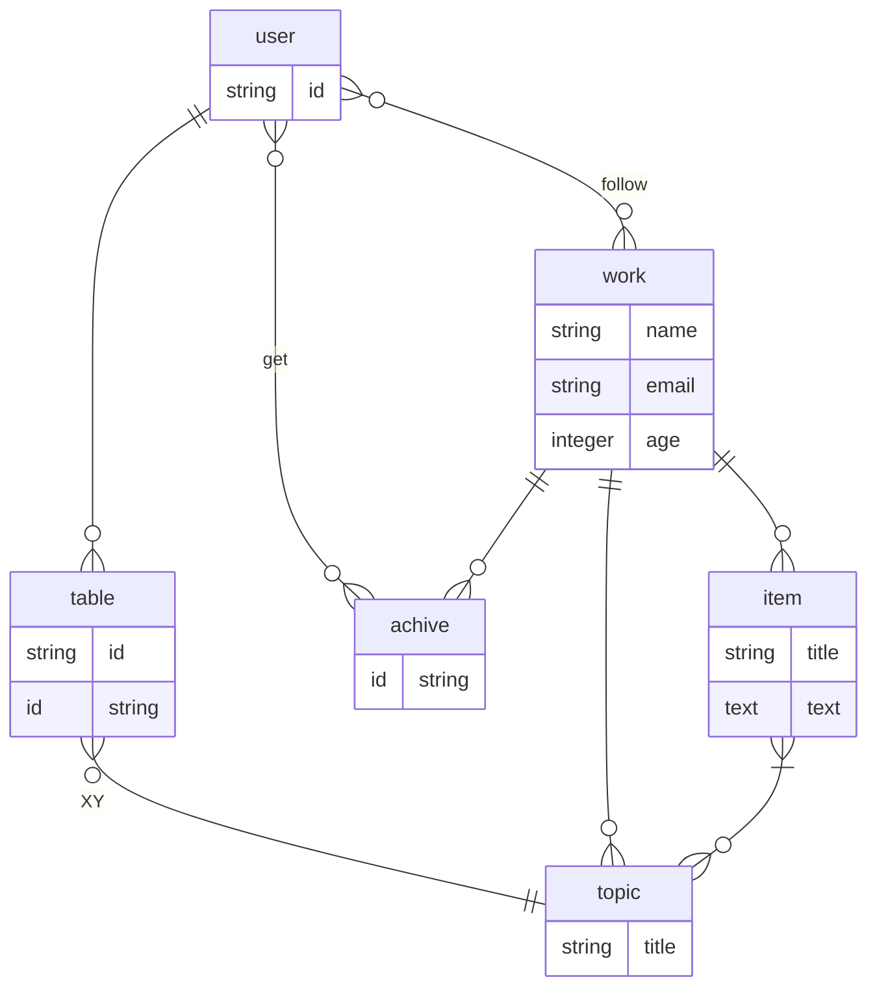

```mermaid
erDiagram

work ||--o{ item: ""
item }|--o{ topic: ""
work ||--o{ topic: ""

work ||--o{ achive: ""

user }o--o{ work: "follow"
user ||--o{ table: ""
user }o--o{ achive: "get"

table }o--|| topic: "XY"

work {
  string name
  string email
  integer age
}

topic {
  string title
}

item {
  string title
  text text
}

user {
  string id
}

table {
  string id
}

table {
  id string
}

achive {
  id string
}
```
